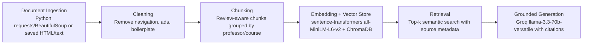

# Project 1 Planning: The Unofficial Guide

> Write this document before you write any pipeline code.
> Your spec and architecture diagram are what you'll use to direct AI tools (Claude, Copilot, etc.) to generate your implementation — the more specific they are, the more useful the generated code will be.
> Update the Retrieval Approach and Chunking Strategy sections if you change your approach during implementation.
> Update this file before starting any stretch features.

---

## Domain

<!-- What domain did you choose? Why is this knowledge valuable and hard to find through official channels? -->
Rutgers New Brunswick Computer Science course and professor reviews. This guide will make unofficial student feedback searchable across professors, courses, workload, exams, attendance expectations, grading style, lecture quality, and support resources. This knowledge is valuable because official course descriptions say what a class covers, but they usually do not explain how students experience a professor's teaching style, grading, homework load, exam difficulty, or classroom expectations.

---

## Documents

<!-- List your specific sources: URLs, subreddit names, forum threads, or file descriptions.
     Aim for at least 10 sources that together cover different subtopics or perspectives within your domain. -->

| # | Source | Description | URL or location |
|---|--------|-------------|-----------------|
| 1 | Rate My Professors: Ana Paula Centeno | Rutgers CS reviews for CS111/CS112, including notes on exams, assignments, lectures, and study materials. | https://www.ratemyprofessors.com/professor/600296 |
| 2 | Rate My Professors: Lars Sorensen | Rutgers CS111 reviews covering beginner difficulty, homework load, exams, lecture style, and classroom expectations. | https://www.ratemyprofessors.com/professor/2279091 |
| 3 | Rate My Professors: Pedro Pajarillo | Rutgers CS111 reviews focused on introductory programming, feedback, extra credit, and student support. | https://www.ratemyprofessors.com/professor/3025313 |
| 4 | Rate My Professors: John-Austen Francisco | Rutgers CS reviews describing lecture organization, assignments, exams, accessibility, and mixed student experiences. | https://www.ratemyprofessors.com/professor/1833903 |
| 5 | Rate My Professors: Jeffrey Ames | Rutgers CS205 and systems-related reviews covering homework weight, quizzes/exams, lecture clarity, and accommodations. | https://www.ratemyprofessors.com/professor/2256513 |
| 6 | Rate My Professors: Alexander Borgida | Rutgers CS205 reviews covering discrete structures, slide quality, lecture clarity, office hours, and self-study needs. | https://www.ratemyprofessors.com/professor/173951 |
| 7 | Rate My Professors: Uli Kremer | Rutgers CS314/compiler and systems reviews covering projects, exams, office hours, lecture notes, and assignment difficulty. | https://www.ratemyprofessors.com/professor/1815726 |
| 8 | Rate My Professors: Srinivas Narayana | Rutgers CS reviews for systems courses, including projects, quizzes, recordings, lecture quality, and office hours. | https://www.ratemyprofessors.com/professor/2481805 |
| 9 | Rate My Professors: Ahmed Elgammal | Rutgers AI/ML/computer vision reviews covering math intensity, projects, lectures, flexibility, and grading. | https://www.ratemyprofessors.com/professor/184976 |
| 10 | Rate My Professors: Aaron Bernstein | Rutgers upper-level CS reviews covering extra credit, homework, exams, curves, recordings, and lecture attendance. | https://www.ratemyprofessors.com/professor/2447976 |

These documents are mostly short, informal student reviews rather than long official guides. The corpus should be able to answer questions like which professors are described as helpful, which classes have heavy homework or exam pressure, where extra credit is mentioned, whether attendance matters, and what students say about lecture clarity.

---

## Chunking Strategy

<!-- How will you split documents into chunks?
     State your chunk size (in tokens or characters), overlap size, and explain why those
     numbers fit the structure of your documents.
     A review-heavy corpus warrants different chunking than a long FAQ. -->

**Chunk size:** One individual student review per chunk (review-aware chunking), with a soft cap of ~600 characters. The large majority of reviews fall well under this cap, so most chunks are a single complete review of roughly 1–4 sentences (~250–500 characters). If a single review exceeds the cap, it is split on sentence boundaries into at most two chunks.

**Overlap:** No overlap between reviews (0 characters across review boundaries). For the rare oversized review that must be split, I use a small ~50-character sentence-boundary overlap so a thought that straddles the split point stays recoverable.

**Reasoning:** My documents are not long-form guides — each Rate My Professors page is a stack of short, self-contained opinions, and a single review is the natural unit of meaning. Splitting on a fixed character count (e.g., "every 500 chars") would slice one student's opinion in half and merge the tail of one reviewer with the head of another, producing chunks that mix two unrelated verdicts and embed to a muddy average. Keeping one review per chunk means each embedding represents a single coherent stance ("exams are code-heavy but fair"), which is exactly the granularity my evaluation questions ask about. I avoid cross-review overlap for the same reason: overlap is useful when one fact is spread across adjacent paragraphs of a continuous document, but here adjacent text belongs to different authors, so overlap would only bleed one reviewer's words into another's chunk. Each chunk carries metadata (professor name, source URL, course tag if present) so attribution survives chunking. Signs the choice is wrong: if chunks were too small (e.g., per-sentence), a query like "is the homework hard but the exams easy?" would lose the contrast that lived in one review; if too large (whole page per chunk), retrieval would return a 40-review blob where the relevant sentence is diluted and the LLM can't tell which opinion is which.

---

## Retrieval Approach

<!-- Which embedding model are you using (e.g., all-MiniLM-L6-v2 via sentence-transformers)?
     How many chunks will you retrieve per query (top-k)?
     If you were deploying this for real users and cost wasn't a constraint, what tradeoffs
     would you weigh in choosing a different embedding model — context length, multilingual
     support, accuracy on domain-specific text, latency? -->

**Embedding model:** `all-MiniLM-L6-v2` via `sentence-transformers`. It runs locally with no API key or rate limits, produces 384-dimensional embeddings, is fast on CPU, and is well suited to short sentence-level text — which matches my one-review-per-chunk strategy. Its 256-token input window is not a constraint here because individual reviews are short.

**Top-k:** k = 5 by default. Because each chunk is one review and any given professor has many reviews, a single review is rarely the whole story; retrieving ~5 lets the LLM see a spread of opinions and surface agreement or disagreement. Too few (k = 1–2) risks returning one outlier review and missing the consensus; too many (k = 15+) pulls in loosely related reviews from other professors/courses, dilutes the prompt, and raises the chance the model latches onto an off-topic chunk. I may filter out chunks below a similarity threshold so weak matches don't pad the context.

**Production tradeoff reflection:** If cost weren't a constraint, I'd weigh a stronger hosted embedding model (e.g., OpenAI `text-embedding-3-large` or Cohere embeddings) for better semantic accuracy on slangy, sarcastic student text where MiniLM can miss nuance ("his lectures put me to sleep" implies a complaint without negative keywords). The tradeoffs: (1) accuracy/recall — larger models capture finer distinctions but with diminishing returns on already-short text; (2) latency and dependency — an API adds network round-trips and a hard dependency on an external service vs. MiniLM running fully local; (3) cost at scale — per-token API billing for thousands of chunks plus every query; (4) context length — not relevant for my short reviews, but it would matter if I expanded to long-form guides or Reddit megathreads; (5) multilingual support — unnecessary for an English-only Rutgers corpus, but a multilingual model (e.g., `paraphrase-multilingual-MiniLM`) would matter for an international or multi-campus deployment; (6) privacy — local embedding keeps student opinions off third-party servers. For this project, the local model's zero cost, low latency, and good-enough accuracy on short text make it the right default.

---

## Evaluation Plan

<!-- List your 5 test questions with their expected correct answers.
     Questions should be specific enough that you can judge whether the system's response
     is right or wrong. "What are good dining halls?" is too vague.
     "What do students say about wait times at [dining hall name] during lunch?" is testable. -->

| # | Question | Expected answer |
|---|----------|-----------------|
| 1 | What do students say about Ana Paula Centeno's CS111 exams and assignments? | Reviews are mixed: some students say assignments are simple but lengthy and exams are code-heavy, while others describe the exams and assignments as unnecessarily hard. Several reviews mention that past exams or study materials are useful. |
| 2 | Which Rutgers CS professor reviews mention extra credit or generous grading support? | Pedro Pajarillo and Aaron Bernstein. Pajarillo reviews mention extra credit and supportive feedback, while Bernstein reviews repeatedly mention extra credit, dropped homework, generous curves, and grading support. |
| 3 | What are the main complaints about John-Austen Francisco's teaching? | Students complain that lectures can be boring, lecture-heavy, disorganized, or hard to follow, and that exams can be tough even when assignments are straightforward. |
| 4 | Which professor is associated with math-heavy AI or machine learning content? | Ahmed Elgammal. Reviews describe his courses as hard, math-heavy, and related to AI, computer vision, or machine learning, while also noting that he is caring and knowledgeable. |
| 5 | What do students say about Srinivas Narayana's lectures and course structure? | Students generally describe him as enthusiastic, clear, well-structured, and helpful, with recorded lectures, available resources, hard but fair assignments/exams, and participation or attendance helping understanding. |

---

## Anticipated Challenges

<!-- What could go wrong? Name at least two specific risks with reasoning.
     Consider: noisy or inconsistent documents, missing source attribution, off-topic
     retrieval, chunks that split key information across boundaries. -->

1. Reviews are noisy and subjective. Different students may describe the same professor in opposite ways, so the system needs to summarize disagreement instead of flattening reviews into a single confident recommendation.

2. Course and professor names can be ambiguous. A query like "who is good for intro CS?" might match CS111 reviews across multiple professors, while a query using only a course number may retrieve reviews that mention the course but do not answer the user's specific concern.

---

## Architecture

<!-- Draw a diagram of your pipeline showing the five stages:
     Document Ingestion → Chunking → Embedding + Vector Store → Retrieval → Generation
     Label each stage with the tool or library you're using.
     You can use ASCII art, a Mermaid diagram, or embed a sketch as an image.
     You'll use this diagram as context when prompting AI tools to implement each stage. -->

---

## AI Tool Plan

<!-- For each part of the pipeline below, describe:
     - Which AI tool you plan to use (Claude, Copilot, ChatGPT, etc.)
     - What you'll give it as input (which sections of this planning.md, which requirements)
     - What you expect it to produce
     - How you'll verify the output matches your spec

     "I'll use AI to help me code" is not a plan.
     "I'll give Claude my Chunking Strategy section and ask it to implement chunk_text()
     with my specified chunk size and overlap" is a plan. -->

**Milestone 3 — Ingestion and chunking:**
I will give the AI the Domain, Documents, and Chunking Strategy sections and ask it to implement an ingestion script that saves each review document with metadata such as professor name, source URL, course tags, and review text. I will verify the output by inspecting a few processed documents and checking that boilerplate like navigation links and privacy notices is removed.

**Milestone 4 — Embedding and retrieval:**
I will give the AI the Retrieval Approach section and ask it to implement local embeddings with `sentence-transformers` and persistence with ChromaDB. I will verify retrieval before generation by running the five evaluation questions and checking whether the returned chunks mention the expected professor, course, and topic.

**Milestone 5 — Generation and interface:**
I will give the AI the grounding requirements and evaluation questions and ask it to build a simple CLI or notebook query interface that prints an answer plus cited source documents. I will verify that answers only use retrieved context by testing questions whose answers are not present in the corpus and checking that the system refuses or says the documents do not contain enough information.
